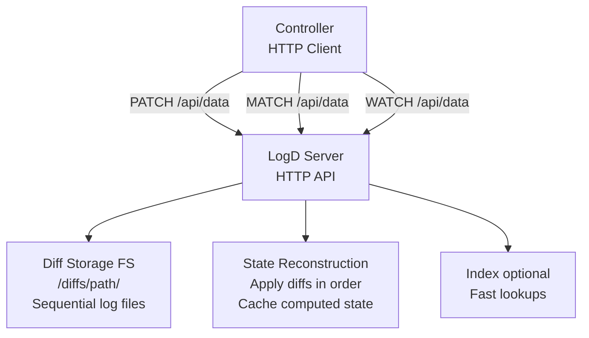

# LogD Server Design

A filesystem-based backend server for storing Tony diffs and reconstructing state on demand. This provides the diff-based storage layer for TonyAPI, similar to etcd's log-based storage but operating on a filesystem.

## Overview

The LogD server maintains a log of diffs (changes) as the source of truth. Current state is computed by applying all diffs in sequence. This design provides:

- **History**: Complete audit trail of all changes
- **Time-travel**: Reconstruct state at any point in time
- **Efficiency**: Only store changes, not full state snapshots
- **Simplicity**: Filesystem-based, easy to backup and inspect
- **Durability**: Filesystem provides persistence

## Architecture



## Filesystem Structure

```
/logd/
├── meta/
│   ├── version          # Protocol version
│   ├── seq              # Binary sequence state file (16 bytes)
│   │                     # Offset 0-7: commit count (56 bits)
│   │                     # Offset 8-15: transaction seq (56 bits)
│   ├── transactions.log # Transaction commit log (wire-encoded, newline-separated)
│   └── transactions/    # Transaction state files
│       ├── tx-12345-2.pending  # Pending transaction (2 participants)
│       └── ...
├── paths/
│   ├── proc/
│   │   └── processes/
│   │       ├── 1-1.diff          # Committed diff (commitCount=1, txSeq=1)
│   │       ├── 1-2.diff          # Committed diff (commitCount=1, txSeq=2)
│   │       ├── 3.pending         # Pending transaction diff (txSeq=3, not visible to reads)
│   │       ├── 2-4.diff          # Committed diff (commitCount=2, txSeq=4)
│   │       └── ...
│   ├── users/
│   │   ├── 1-1.diff
│   │   ├── 1-2.diff
│   │   └── ...
│   └── posts/
│       └── ...
└── snapshots/           # Optional periodic snapshots
    ├── proc/
    │   └── processes/
    │       └── 00001000.snapshot  # State at commitCount 10000
    └── ...
```

### Path Mapping

Virtual document paths map to filesystem directories:

- `/proc/processes` → `/logd/paths/proc/processes/`
- `/users` → `/logd/paths/users/`
- `/users/123/posts` → `/logd/paths/users/123/posts/`

### Diff File Format

Each diff file is a Tony document containing a Tony diff:

```tony
# /logd/paths/proc/processes/1-1.diff
seq: 1
timestamp: "2024-01-15T10:00:00Z"
path: "/proc/processes"
diff: !key(id)
  - !insert
    id: "proc-1"
    pid: 1234
    name: "nginx"
    state: "running"
    launchedAt: "2024-01-15T10:00:00Z"
```

```tony
# /logd/paths/proc/processes/2-4.diff
seq: 4
timestamp: "2024-01-15T10:05:00Z"
path: "/proc/processes"
diff: !key(id)
  - id: "proc-1"
    stat:
      rss: !replace
        from: 4096
        to: 8192
```

### Sequence Numbers

The storage layer maintains two types of sequence numbers:

1. **Transaction Sequence (`txSeq`)**: Monotonically increasing number assigned when a diff is written (even if pending). Each diff gets a unique `txSeq`.

2. **Commit Count (`commitCount`)**: Monotonically increasing number assigned when a transaction is committed. All diffs in the same transaction receive the same `commitCount`.

**Storage Format:**

- Stored in binary file `/logd/meta/seq` (16 bytes, little-endian)
- Offset 0-7: commit count (56 bits)
- Offset 8-15: transaction seq (56 bits)
- Both values are masked to 56 bits to allow future expansion

**Filename Format:**

- Committed diffs: `{commitCount}-{txSeq}.diff`
- Pending diffs: `{txSeq}.pending` (no commit count prefix)

**Ordering:**

- Readers use `commitCount` to determine which diffs to include (only committed diffs)
- `commitCount` ensures monotonic ordering of committed transactions, independent of creation order
- This allows readers to maintain coherence even when transactions commit out of order

## API Interface

The LogD server provides an HTTP interface that aligns with the higher-level TonyAPI HTTP methods (MATCH, PATCH, WATCH) for consistency.

### HTTP API Overview

**HTTP Methods:**

- `PATCH /api/data` - Write a diff (single-path or multi-path with transaction) or create/abort transactions (using path: match: patch: layout)
- `MATCH /api/data` - Read/reconstruct state (returns diff from null) or get transaction status (using path: match: layout)
- `WATCH /api/data` - Watch for changes (streams diffs) or watch transaction evolution (using path: match: layout). With `X-To-Seq` header, streams diffs in a range and closes.

**HTTP Status Codes:**

- `200 OK` - Success
- `400 Bad Request` - Tony application error (error details in Tony error body)
- `500 Internal Server Error` - Non-Tony error (server bug, infrastructure issue)

**Content-Type:** `application/x-tony` for all requests and responses

**Key Design Principles:**

- All read/write/watch operations use the **`path: match: patch: meta:`** layout from the higher-level TonyAPI
- The `meta:` field contains computed fields that are NOT already present in `patch:`, such as sequence numbers and timestamps
- All read/write/watch payloads are **diffs** (no state/diff distinction)
- Clients start with a `null` document and apply diffs sequentially
- All Tony application errors return HTTP `400` with error details in the response body
- **PATCH Convention**: When a key/ID is missing in the `match:` section, PATCH means create. The response includes computed fields (including the generated ID) in the `patch:` section, making it REST POST-like.
- **Array Paths**: When the path schema is an array, MATCH/PATCH operations apply to all documents in the array

### Create Transaction (Request Transaction ID)

**HTTP:** `PATCH /api/data`

For multi-path operations requiring atomicity, the document server requests a transaction ID from the logd server.

**Request Body:** (Following path: match: patch: layout, no transactionId in match - this triggers create)
```tony
path: /api/transactions
match: null
patch: !key(id)
  - !insert
    participantCount: 2
```

**Response:** `200 OK` with Tony document
```tony
path: /api/transactions
match: null
patch: !key(id)
  - !insert
    transactionId: "tx-12345-2"
    participantCount: 2
    status: "pending"
```

**Error:** `400` with Tony error body if request is invalid

**Note:** This follows the `path: match: patch:` layout from the higher-level TonyAPI. Since `match: null` (no transactionId specified), this creates a new transaction. The response includes all computed fields (including the generated transactionId) in the `patch:` section. The transaction ID encodes the participant count (e.g., `tx-12345-2` where `2` indicates 2 participants must complete).

### Get Transaction Status

**HTTP:** `MATCH /api/data`

**Request Body:** (Following path: match: layout)
```tony
path: /api/transactions
match:
  transactionId: "tx-12345-2"
```

**Response:** `200 OK` with Tony document (just the transaction structure)
```tony
transactionId: "tx-12345-2"
status: "pending"  # or "committed", "aborted"
participantCount: 2
participantsReceived: 1
createdAt: "2024-01-15T10:00:00Z"
```

**Error:** `400` if transaction not found

### Abort Transaction

**HTTP:** `PATCH /api/data`

If a transaction needs to be aborted (e.g., validation failure in a controller), the document server can abort it.

**Request Body:** (Following path: match: patch: layout)
```tony
path: /api/transactions
match:
  transactionId: "tx-12345-2"
patch: !delete null
```

**Response:** `200 OK` with Tony document
```tony
path: /api/transactions
match:
  transactionId: "tx-12345-2"
patch: !key(id)
  - transactionId: "tx-12345-2"
    status: !replace
      from: "pending"
      to: "aborted"
    participantsDiscarded: !insert 1
```

**Error:** `400` if transaction not found or already committed/aborted

**Note:** The request follows the `path: match: patch:` layout from the higher-level TonyAPI. The `match:` section identifies the transaction by `transactionId`, and `patch: !delete null` deletes/aborts the entire transaction. Attempting to update a transaction (other than aborting) will return an error, as transactions are read-only once created. The response includes computed fields (like `status` change and `participantsDiscarded`) in the `patch:` section.

All pending diffs for the transaction are discarded and will not be committed.

### Watch Transaction Evolution

**HTTP:** `WATCH /api/data`

**Request Body:** (Following path: match: layout)
```tony
path: /api/transactions
match:
  transactionId: "tx-12345-2"
```

**Response:** `200 OK` with `Content-Type: application/x-tony` (streaming)

**Stream Format:** A sequence of documents, each with `meta:` and `diff:` fields, separated by `---`:
```tony
meta:
  timestamp: "2024-01-15T10:00:00Z"
diff: !key(id)
  - transactionId: "tx-12345-2"
    status: !insert "pending"
    participantCount: !insert 2
    participantsReceived: !insert 1
---
meta:
  timestamp: "2024-01-15T10:01:00Z"
diff: !key(id)
  - transactionId: "tx-12345-2"
    participantsReceived: !replace
      from: 1
      to: 2
---
meta:
  timestamp: "2024-01-15T10:02:00Z"
diff: !key(id)
  - transactionId: "tx-12345-2"
    status: !replace
      from: "pending"
      to: "committed"
    commitCount: !insert 42
---
```

**Note:** Streams documents with `meta:` and `diff:` fields showing transaction state changes as the transaction evolves from pending → committed/aborted. The `diff:` field contains the actual diff content, and `meta:` contains timestamps. Each document is separated by `---`.

### Write Diff

**HTTP:** `PATCH /api/data`

**Single-path write (no transaction):**

**Request Body:** (Following path: match: patch: layout)
```tony
path: /proc/processes
match: null
patch: !key(id)
  - !insert
    id: "proc-1"
    pid: 1234
    name: "nginx"
    state: "running"
```

**Response:** `200 OK` with Tony document (the diff that was written, with computed fields in meta:)
```tony
path: /proc/processes
match: null
patch: !key(id)
  - !insert
    id: "proc-1"
    pid: 1234
    name: "nginx"
    state: "running"
meta:
  seq: 42
  timestamp: "2024-01-15T10:00:00Z"
```

**Multi-path write (with transaction):**

**Request Body:** (Following path: match: patch: meta: layout)
```tony
path: /proc/processes
match: null
patch: !key(id)
  - !insert
    id: "proc-1"
    pid: 1234
    name: "nginx"
    state: "running"
meta:
  tx-id: "tx-12345-2"
  deadline: "30s"  # optional
```

**Response (first participant - pending):** `200 OK` with Tony document (the diff that was written, with computed fields in meta:)
```tony
path: /proc/processes
match: null
patch: !key(id)
  - !insert
    id: "proc-1"
    pid: 1234
    name: "nginx"
    state: "running"
meta:
  transactionId: "tx-12345-2"
  timestamp: "2024-01-15T10:00:00Z"
```

**Response (last participant - committed):** `200 OK` with Tony document (the diff that was written, with computed fields in meta:)
```tony
path: /proc/processes
match: null
patch: !key(id)
  - !insert
    id: "proc-1"
    pid: 1234
    name: "nginx"
    state: "running"
meta:
  transactionId: "tx-12345-2"
  seq: 42
  timestamp: "2024-01-15T10:00:00Z"
```

**Error:** `400` with Tony error body
```tony
error:
  code: "invalid_diff"
  message: "Diff format invalid"
```

**Note:** When the path schema is an array, the diff applies to all documents in the array. For example, if `/proc/processes` is an array, the `patch:` structure should match the array element schema and will be applied to all elements. The request follows the `path: match: patch:` layout from the higher-level TonyAPI. The response includes computed fields (like `seq` and `timestamp`) in the `meta:` field.

### Read State (Reconstruct)

**HTTP:** `MATCH /api/data`

**Request Body:** (Following path: match: layout)
```tony
path: /proc/processes
match: null
meta:
  seq: null  # null = latest, or specific commitCount for time-travel
```

**Response:** `200 OK` with Tony document (diff structure with meta:)
```tony
path: /proc/processes
match: null
patch: !key(id)
  - !insert
    id: "proc-1"
    pid: 1234
    name: "nginx"
    state: "running"
    # ... diff from null (represents full current state)
meta:
  seq: 42
```

**Note:** The response follows the `path: match: patch: meta:` layout. The `patch:` field contains the diff structure. This diff represents the complete state when applied to `null`. For time-travel queries, specify the `seq` field in the request `meta:` section. The diff uses Tony diff operations (`!insert`, `!replace`, `!delete`, etc.) to represent changes from `null`. When the path schema is an array, the diff applies to all documents in the array. The `meta:` field contains computed fields like `seq`.

### Read Diffs (History)

**HTTP:** `WATCH /api/data`

**Request Body:** (Following path: match: layout)
```tony
path: /proc/processes
match: null
meta:
  fromSeq: 1
  toSeq: 100
```

**Response:** `200 OK` with `Content-Type: application/x-tony` (streaming)

**Stream Format:** A sequence of documents, each with `meta:` and `diff:` fields, separated by `---`:
```tony
meta:
  seq: 1
  timestamp: "2024-01-15T10:00:00Z"
diff: !key(id)
  - !insert
    id: "proc-1"
    pid: 1234
    name: "nginx"
---
meta:
  seq: 2
  timestamp: "2024-01-15T10:01:00Z"
diff: !key(id)
  - id: "proc-1"
    stat:
      rss: !replace
        from: 4096
        to: 8192
---
```

**Note:** When `meta.toSeq` is provided, the stream closes after sending all diffs up to that commitCount. Without `meta.toSeq`, it continues streaming indefinitely. Each document contains `meta:` with sequence numbers and timestamps, and `diff:` with the actual diff content (as in `o d -loop`).

### Watch (Subscribe to Changes)

**HTTP:** `WATCH /api/data`

**Request Body:** (Following path: match: layout)
```tony
path: /proc/processes
match: null
meta:
  fromSeq: 42  # Optional, omit or use 0 to start from beginning
  toSeq: 100   # Optional, if provided stream closes after this commitCount
```

**Response:** `200 OK` with `Content-Type: application/x-tony` (streaming)

**Stream Format:** A sequence of documents, each with `meta:` and `diff:` fields, separated by `---`:
```tony
meta:
  seq: 42
  timestamp: "2024-01-15T10:00:00Z"
diff: !key(id)
  - !insert
    id: "proc-1"
    pid: 1234
    name: "nginx"
    state: "running"
---
meta:
  seq: 43
  timestamp: "2024-01-15T10:01:00Z"
diff: !key(id)
  - !insert
    id: "proc-2"
    pid: 5678
    name: "worker"
    state: "running"
---
meta:
  seq: 44
  timestamp: "2024-01-15T10:02:00Z"
diff: !key(id)
  - id: "proc-1"
    state: !replace
      from: "running"
      to: "killed"
---
```

**Note:** Streams documents with `meta:` and `diff:` fields (the `diff:` field contains the actual diff as in `o d -loop`). If `meta.fromSeq` is omitted or 0, the first diff is from `null` representing the full current state (using `!insert` operations). Subsequent diffs are incremental using appropriate Tony diff operations (`!insert`, `!replace`, `!delete`, etc.). When the path schema is an array, diffs apply to all documents in the array. If `meta.toSeq` is provided, the stream closes after sending all diffs up to that commitCount (history mode). Without `meta.toSeq`, it continues streaming indefinitely (watch mode). Each document is separated by `---`.

## State Reconstruction

### Reading State (Excluding Pending Transactions)

When reconstructing state, only committed diffs are included - pending transactions are excluded:

```bash
function reconstruct_state() {
    local path=$1
    local target_commit_count=$2
    
    # Start from null or snapshot
    local state="null"
    
    # Read all committed diff files, sorted by commit count
    # Filename format: {commitCount}-{txSeq}.diff
    for diff_file in $(ls "/logd/paths/${path}/"*.diff | sort -t- -k1 -n); do
        local commit_count=$(extract_commit_count_from_filename "$diff_file")
        
        # Skip if beyond target_commit_count
        if [ "$target_commit_count" != "null" ] && [ "$commit_count" -gt "$target_commit_count" ]; then
            break
        fi
        
        # Only process committed diffs (.pending files are excluded)
        local diff=$(cat "$diff_file")
        state=$(o patch "$state" "$diff")
    done
    
    echo "$state"
}
```

Pending transaction diffs (`.pending` files) are never included in state reconstruction until they are committed (renamed to `.diff` with a commit count).

**Coherence Guarantee:**

- Readers use `commitCount` to filter diffs, ensuring they only see fully committed transactions
- Even if transactions commit out of order, readers maintain coherence by using `commitCount` for ordering
- The transaction log (`transactions.log`) records which `commitCount` was assigned to each transaction

### Algorithm

1. **Start with null state**: `state = null`
2. **Load all committed diffs** for the path, ordered by commit count (skip `.pending` files)
3. **Apply each diff** using `o patch`:
   ```bash
   echo "$state" > /tmp/current.tony
   echo "$diff" > /tmp/diff.tony
   state=$(o patch /tmp/diff.tony /tmp/current.tony)
   ```
4. **Return final state**

**Note:** Diffs are ordered by `commitCount`, not `txSeq`, to ensure readers see transactions in commit order, not creation order.

### Optimization: Snapshots

To avoid replaying all diffs from the beginning:

1. **Periodic snapshots**: Every N commits (e.g., every 1000), write a full state snapshot
2. **Snapshot format**: Full state at that commit count
3. **Reconstruction**: Start from nearest snapshot, then apply only subsequent diffs

```bash
# Find nearest snapshot <= target_commit_count
snapshot_commit_count=$(find_nearest_snapshot "$path" "$target_commit_count")

# Load snapshot
state=$(load_snapshot "$path" "$snapshot_commit_count")

# Apply diffs after snapshot (ordered by commit count)
for commit_count in $(seq $((snapshot_commit_count + 1)) $target_commit_count); do
    diff=$(load_diff_by_commit_count "$path" "$commit_count")
    state=$(o patch "$diff" "$state")
done
```

### Caching

- **In-memory cache**: Cache recently reconstructed states
- **Cache key**: `(path, commitCount)`
- **Cache invalidation**: Invalidate on commit to that path
- **LRU eviction**: Evict least recently used entries

## Implementation Details

### Transaction State Tracking

The logd server maintains transaction state in memory and on disk:

**In-memory transaction map:**
```go
type TransactionState struct {
    TransactionID    string
    ParticipantCount int
    ParticipantsReceived int
    Diffs            []PendingDiff
    CreatedAt        time.Time
    Status           string  // "pending", "committed", "aborted"
}

type PendingDiff struct {
    Path     string
    Diff     tony.Diff
    Seq      int64  // Assigned when committed
    WrittenAt time.Time
}

transactions := make(map[string]*TransactionState)
```

**On-disk transaction state:**
```
/logd/
├── meta/
│   ├── transactions.log         # Transaction commit log (wire-encoded, newline-separated)
│   ├── transactions/
│   │   ├── tx-12345-2.pending  # Transaction state file
│   │   └── ...
```

**Transaction Log Format:**

- Wire-encoded Tony documents, one entry per line (newline-separated)
- Each entry contains: `commitCount`, `transactionId`, `timestamp`, `pendingFiles[]`
- Used for recovery and atomic commit coordination
- Supports binary search by `commitCount` for efficient queries

**Transaction state file format:**
```tony
# /logd/meta/transactions/tx-12345-2.pending
transactionId: "tx-12345-2"
participantCount: 2
participantsReceived: 1
status: "pending"
createdAt: "2024-01-15T10:00:00Z"
diff:
  - path: "/users"
    diffFile: "/logd/paths/users/42.pending"
    writtenAt: "2024-01-15T10:00:00Z"
```

**Transaction log entry format:**
```tony
# Wire-encoded, one entry per line in transactions.log
{commitCount: 1 transactionId: tx-12345-2 timestamp: "2024-01-15T10:00:00Z" pendingFiles: [{path: /users txSeq: 42} {path: /posts txSeq: 43}]}
```

### Request Transaction ID

```bash
# Generate transaction ID with participant count encoded
function request_transaction() {
    local participant_count=$1
    local tx_seq=$(get_next_tx_seq)  # Get next transaction sequence number
    local transaction_id="tx-${tx_seq}-${participant_count}"
    
    # Create transaction state
    mkdir -p "/logd/meta/transactions"
    cat > "/logd/meta/transactions/${transaction_id}.pending" <<TONY
transactionId: "${transaction_id}"
participantCount: ${participant_count}
participantsReceived: 0
status: "pending"
createdAt: "$(date -u +%Y-%m-%dT%H:%M:%SZ)"
diff: []
TONY
    
    echo "transaction_id: ${transaction_id}"
    echo "participant_count: ${participant_count}"
}
```

### Write Operation

**Single-path write (no transaction):**

Same as before - write diff file, increment sequence number, return immediately.

**Multi-path write (with transaction):**

```bash
function write_diff_with_transaction() {
    local transaction_id=$1
    local participant_count=$2
    local path=$3
    local diff=$4
    
    # Load transaction state
    local state_file="/logd/meta/transactions/${transaction_id}.pending"
    if [ ! -f "$state_file" ]; then
        echo "error: transaction not found"
        return 1
    fi
    
    # Parse transaction state
    local participants_received=$(get_field "$state_file" "participants_received")
    local expected_count=$(get_field "$state_file" "participant_count")
    
    # Validate participant count matches transaction ID
    local tx_count=$(extract_participant_count "$transaction_id")
    if [ "$tx_count" != "$expected_count" ] || [ "$tx_count" != "$participant_count" ]; then
        echo "error: participant count mismatch"
        return 1
    fi
    
    # Write diff to pending file (not committed yet)
    local tx_seq=$(get_next_tx_seq)  # Get next transaction sequence number
    local pending_file="/logd/paths/${path}/${tx_seq}.pending"
    echo "$diff" > "$pending_file"
    
    # Update transaction state
    participants_received=$((participants_received + 1))
    update_transaction_state "$transaction_id" "$participants_received" "$path" "$pending_file" "$tx_seq"
    
    if [ "$participants_received" -eq "$expected_count" ]; then
        # All participants received - commit transaction atomically
        local commit_count=$(get_next_commit_count)  # Get next commit count
        commit_transaction "$transaction_id" "$commit_count"
        echo "success: true"
        echo "transaction_id: ${transaction_id}"
        echo "participants_received: ${participants_received}"
        echo "participants_expected: ${expected_count}"
        echo "seq: ${commit_count}"  # Return commit count as seq
        echo "committed: true"
    else
        # Still waiting for more participants
        echo "success: true"
        echo "transaction_id: ${transaction_id}"
        echo "participants_received: ${participants_received}"
        echo "participants_expected: ${expected_count}"
        echo "pending: true"
    fi
}

function commit_transaction() {
    local transaction_id=$1
    local commit_count=$2
    local state_file="/logd/meta/transactions/${transaction_id}.pending"
    
    # Atomically rename all pending diff files to committed files
    # All diffs in the transaction get the same commit count
    local diffs=$(get_field "$state_file" "diff")
    local pending_refs=()
    for diff_info in $diffs; do
        local pending_file=$(get_field "$diff_info" "diffFile")
        local path=$(get_field "$diff_info" "path")
        local tx_seq=$(extract_tx_seq_from_pending_filename "$pending_file")
        local committed_file="/logd/paths/${path}/${commit_count}-${tx_seq}.diff"
        
        # Atomic rename: {txSeq}.pending -> {commitCount}-{txSeq}.diff
        mv "$pending_file" "$committed_file"
        
        pending_refs+=("${path}:${tx_seq}")
    done
    
    # Append to transaction log atomically
    append_transaction_log "$commit_count" "$transaction_id" "${pending_refs[@]}"
    
    # Remove transaction state file
    rm "$state_file"
    
    # Update in-memory transaction state
    delete_transaction "$transaction_id"
}

function abort_transaction() {
    local transaction_id=$1
    local state_file="/logd/meta/transactions/${transaction_id}.pending"
    
    if [ ! -f "$state_file" ]; then
        echo "error: transaction not found"
        return 1
    fi
    
    # Delete all pending diff files
    local diffs=$(get_field "$state_file" "diffs")
    local discarded=0
    for diff_info in $diffs; do
        local pending_file=$(get_field "$diff_info" "diff_file")
        rm "$pending_file"
        discarded=$((discarded + 1))
    done
    
    # Remove transaction state file
    rm "$state_file"
    
    # Update in-memory transaction state
    delete_transaction "$transaction_id"
    
    echo "success: true"
    echo "transaction_id: ${transaction_id}"
    echo "aborted: true"
    echo "participants_discarded: ${discarded}"
}
```

### Read Operation

```bash
#!/bin/bash
# Simplified read operation

read INPUT

PATH=$(echo "$INPUT" | grep "path:" | awk '{print $2}' | tr -d '"')
TARGET_SEQ=$(echo "$INPUT" | grep "seq:" | awk '{print $2}')

# If target_seq is null, use latest
if [ "$TARGET_SEQ" = "null" ] || [ -z "$TARGET_SEQ" ]; then
    TARGET_SEQ=$(cat /logd/meta/last_seq)
fi

# Check cache
CACHE_KEY="${PATH}:${TARGET_SEQ}"
if cache_exists "$CACHE_KEY"; then
    state=$(cache_get "$CACHE_KEY")
else
    # Reconstruct state
    state=$(reconstruct_state "$PATH" "$TARGET_SEQ")
    cache_set "$CACHE_KEY" "$state"
fi

# Return state
cat <<TONY
read:
  success: true
  path: "$PATH"
  seq: $TARGET_SEQ
  state:
$state
TONY
```

### Reconstruct State Function

```bash
reconstruct_state() {
    local path=$1
    local target_seq=$2
    local diff_dir="/logd/paths/${path//\//\/}"
    
    # Find nearest snapshot
    local snapshot_seq=$(find_nearest_snapshot "$path" "$target_seq")
    
    # Start from snapshot or null
    if [ -n "$snapshot_seq" ] && [ "$snapshot_seq" -gt 0 ]; then
        local state=$(cat "$diff_dir/${snapshot_seq}.snapshot")
        local start_seq=$((snapshot_seq + 1))
    else
        local state="null"
        local start_seq=1
    fi
    
    # Apply all diffs up to target_seq
    for seq in $(seq $start_seq $target_seq); do
        local diff_file="$diff_dir/$(printf "%08d" $seq).diff"
        if [ -f "$diff_file" ]; then
            # Extract diff from file
            local diff=$(grep -A 1000 "^diff:" "$diff_file" | tail -n +2)
            
            # Apply diff using o patch
            echo "$state" > /tmp/current.tony
            echo "$diff" > /tmp/diff.tony
            state=$(o patch /tmp/diff.tony /tmp/current.tony)
        fi
    done
    
    echo "$state"
}
```

## Performance Considerations

### Write Performance

- **Sequential writes**: Diffs are appended sequentially (fast on modern filesystems)
- **No locking needed**: Each diff gets unique sequence number
- **Atomic operations**: Use filesystem atomic rename for sequence number updates
- **Transaction coordination**: Transaction state files use atomic rename for updates
- **Pending diff files**: Transaction diffs written to `.pending` files, atomically renamed to `.diff` on commit

### Read Performance

- **Snapshots**: Reduce reconstruction cost from O(N) to O(M) where M << N
- **Caching**: Cache frequently accessed states
- **Parallel reads**: Multiple reads can happen concurrently (read-only)

### Scalability

- **Path partitioning**: Different paths can be on different storage devices
- **Snapshot frequency**: Adjust based on write frequency
- **Cache size**: Configurable cache size limit

## Consistency Guarantees

### Write Ordering

- **Global transaction sequence numbers**: All writes receive a unique `txSeq` when written
- **Global commit count**: All diffs in a committed transaction receive the same `commitCount`
- **Per-path ordering**: Diffs for a path are applied in commit count order
- **Atomic writes**: Each diff write is atomic (file write is atomic)
- **Transaction atomicity**: All diffs in a transaction receive the same `commitCount` and are committed atomically via transaction log

### Transaction Guarantees

- **Atomicity**: Either all diffs in a transaction are committed or none are (via transaction log)
- **Isolation**: Pending transactions are not visible to reads until committed (readers filter by `commitCount`)
- **Consistency**: All diffs in a transaction receive the same `commitCount` (monotonic ordering)
- **Durability**: Once committed, all transaction diffs are persisted and transaction log entry is written

### Read Consistency

- **Snapshot isolation**: Reads see consistent state at a specific commit count
- **No dirty reads**: Writes don't affect in-flight reads (they use their target commit count)
- **No partial transactions**: Reads never see partial transaction state - only fully committed transactions (filtered by `commitCount`)
- **Coherent ordering**: Even if transactions commit out of order, readers see them in commit order via `commitCount`

### Concurrent Writes

- **Sequential numbering**: Transaction sequence numbers (`txSeq`) ensure unique identification even with concurrent writes
- **Commit ordering**: Commit counts (`commitCount`) ensure monotonic ordering of committed transactions
- **No conflicts**: Diffs are independent - applying them in commit order is always valid
- **Transaction coordination**: Multiple controllers can write to the same transaction concurrently - logd server coordinates commit when all participants complete
- **Recovery**: Transaction log enables recovery of partial commits on server restart

## Integration with Controllers

### Controller Startup

```bash
# Controller connects to LogD server
# Reads all diffs and reconstructs current state

CURRENT_STATE=$(echo "read:
  path: \"/proc/processes\"
  seq: null" | logd-server)

# Send initial diff to document server
echo "null" > /tmp/base.tony
echo "$CURRENT_STATE" > /tmp/current.tony
INITIAL_DIFF=$(o diff /tmp/base.tony /tmp/current.tony)
echo "$INITIAL_DIFF"
```

### Controller Writes

```bash
# Controller receives mutation, applies to backend
NEW_DIFF=$(compute_diff)

# Write to LogD server
echo "write:
  path: \"/proc/processes\"
  diff:
$NEW_DIFF" | logd-server

# LogD server returns seq and timestamp
# Controller can use this for acknowledgments
```

### Controller Subscriptions

```bash
# Controller watches for changes
echo "watch:
  path: \"/proc/processes\"
  from_seq: 42" | logd-server | while read -r update; do
    # Process each diff update
    # Forward to document server as needed
done
```

## Backup and Recovery

### Backup

- **Simple filesystem backup**: Just backup `/logd/` directory
- **Incremental backup**: Only backup new diff files since last backup
- **Snapshot backup**: Backup snapshots for faster recovery

### Recovery

- **Full recovery**: Restore `/logd/` directory, state reconstructs automatically
- **Partial recovery**: Restore specific paths
- **Point-in-time recovery**: Restore up to specific sequence number

### Replication

- **Filesystem replication**: Use filesystem-level replication (rsync, etc.)
- **Sequence-based replication**: Replicate diffs in sequence order
- **Conflict resolution**: Sequence numbers provide natural ordering

## Advanced Features

### Compression

- **Diff compression**: Compress diff files (gzip, etc.)
- **Snapshot compression**: Compress snapshots
- **Transparent decompression**: Decompress on read

### Encryption

- **At-rest encryption**: Encrypt diff files on disk
- **Transparent encryption**: Encrypt/decrypt on write/read
- **Key management**: Store encryption keys securely

### Query Optimization

- **Indexes**: Build indexes for common queries (e.g., by process ID)
- **Materialized views**: Pre-compute common query patterns
- **Query caching**: Cache query results

## Example Usage

### Starting the Server

```bash
# Start LogD server
logd-server --root /var/logd --port 9000
```

### Writing a Diff

```bash
# PATCH /api/data
curl -X PATCH http://localhost:9000/api/data \
  -H "Content-Type: application/x-tony" \
  -d 'path: /proc/processes
match: null
patch: !key(id)
  - !insert
    id: "proc-1"
    pid: 1234
    name: "nginx"
    state: "running"'

# Response:
# path: /proc/processes
# match: null
# patch: !key(id)
#   - !insert
#     id: "proc-1"
#     pid: 1234
#     name: "nginx"
#     state: "running"
# meta:
#   seq: 1
#   timestamp: "2024-01-15T10:00:00Z"
```

### Reading State

```bash
# MATCH /api/data
curl -X MATCH http://localhost:9000/api/data \
  -H "Content-Type: application/x-tony" \
  -d 'path: /proc/processes
match: null
meta:
  seq: null'

# Response:
# path: /proc/processes
# match: null
# patch: !key(id)
#   - !insert
#     id: "proc-1"
#     pid: 1234
#     name: "nginx"
#     state: "running"
# meta:
#   seq: 1
```

### Time-Travel Query

```bash
# MATCH /api/data with specific seq
curl -X MATCH http://localhost:9000/api/data \
  -H "Content-Type: application/x-tony" \
  -d 'path: /proc/processes
match: null
meta:
  seq: 5'

# Returns diff representing state as it was at commitCount 5
```

### Watching Changes

```bash
# WATCH /api/data
curl -X WATCH http://localhost:9000/api/data \
  -H "Content-Type: application/x-tony" \
  -d 'path: /proc/processes
match: null
meta:
  fromSeq: 10'

# Streams documents with meta: and diff: fields starting from commitCount 10 (Tony documents separated by ---)
```

## Comparison with etcd

| Feature     | etcd            | LogD Server 
|---------    |------           |----------------                          |
| Storage     | Key-value store | Filesystem                               |
| API         | gRPC/HTTP       | HTTP (MATCH/PATCH/WATCH)                |
| Consistency | Raft consensus  | Sequential writes                        |
| Replication | Built-in        | Filesystem-level                         |
| History     | Limited         | Complete (all diffs)                     |
| Time-travel | No              | Yes (by seq)                             |
| Simplicity  | Complex         | Simple                                   |
| Performance | High            | Good (with snapshots)                    |

## Future Enhancements

1. **Distributed mode**: Multiple LogD servers with consensus
2. **Compaction**: Remove old diffs after creating snapshots
3. **Query language**: Support Tony query syntax for filtering
4. **Metrics**: Expose metrics for monitoring
5. **Web UI**: Web interface for browsing diffs and state
