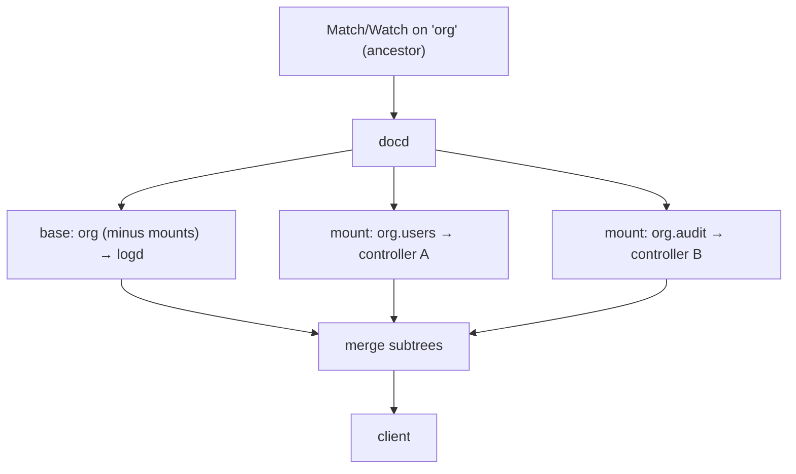

# Composition: reads & watches

docd single-routes an operation to one owner. But a read or watch whose path is an
*ancestor* of one or more mounts has no single owner — the answer lives partly in the
base store and partly in each mounted subtree beneath it. docd **composes** these.

## Composed reads (Match)

When a `Match` path is a strict ancestor of one or more mounts, docd fans the read
across the base owner and every mount below it, reads each subtree, and merges them
into one document before replying. Each source read is bounded by a timeout so one
stalled controller cannot hang the client's read; the composition runs on a background
goroutine so the client's request loop keeps serving.

A read with no mount beneath it — the common single-owner case — is single-routed
normally. Root and `.meta` reads are out of scope for composition.

A source with **nothing at its path** contributes nothing rather than failing the read.
Most paths exist in one source and not in the others, so absence is the ordinary case; the
composed read reports `not_found` only when *every* source is absent, which is the same
answer a direct read of that path gives. Any other failure from any source still fails the
composition, because a merged document missing a subtree nobody could read is not a smaller
answer, it is a wrong one.

## Composed watches

A composed `Watch` multiplexes several backend sub-watches into the client's one watch:

1. docd opens a sub-watch on the base owner and on each mount below the watched path,
   each with `noInit` set — their deltas are buffered as they arrive.
2. docd sends **one** composed initial snapshot (the merged subtrees at the current
   commit) as the watch's `State` event.
3. docd flushes the buffered deltas and then forwards live deltas.

That composed snapshot is a read, so it answers absence the way a read does: if no source
has anything at the watched path, the watch is refused with `not_found` rather than being
established on a document nobody wrote. A client that meant to wait for the path sets
`waitIfAbsent` on its watch request — docd then establishes the watch on a null snapshot,
and carries the flag to the controller owning the subtree, since a controller serving from
its own logd session has to pass it on in turn.

Establishing the sub-watches *before* taking the snapshot is what makes the handoff
gapless: any change between the snapshot and going live is buffered, not lost.

The snapshot is taken before the confirmation only when it could refuse — that is, when
the client did not say `waitIfAbsent`. A client that did keeps the later read, because
reading early buys it nothing and costs it the wait: a source that does not answer reads
would hold up establishing a watch that client was willing to open on nothing. The
sub-watches are up and buffering under either order, so neither misses an event. Failures
other than absence still end the watch after it is established, since by then the client
has a stream to be told on.

### Delta rooting

The watch stream follows one contract:

- the initial **`State`** event is **relative to the watched path** (its value is the
  subtree at that path); and
- every subsequent **`Patch`** (delta) is **root-rooted** — an absolute patch from the
  document root.

Because deltas are root-rooted, docd forwards a sub-watch's delta by re-stamping only
its `Path` to the client's watch path; the patch body passes through unchanged. (logd
may normalize a delta's shape — e.g. emit a `!replace` — so a watch consumer *applies*
deltas to track state rather than pattern-matching their surface form.)

## Coordination

Mount membership must stay fixed for a composed watch's lifetime, or its snapshot and
its sub-watch set would disagree. docd enforces this with a small
reader/writer coordinator:

- **Writers** are `mount`/`unmount`; **readers** are active watches. They conflict on
  **overlapping** paths — one path is a prefix of the other.
- **Writer priority**: once a mount at a path is pending, new overlapping watches block
  until it finishes, so a stream of arriving watches cannot starve a mount.
- The mount then waits **`forceAfter`** (`0` = forever) for the already-active
  overlapping watches to drain; any that remain are **force-ended** so membership can
  change.

## Event preservation & reconnect

**Event preservation** — every state change delivered as a discrete delta — is a
**logd guarantee**, resting on logd's single commit sequence: a single-route watch
inherits it fully, and `FromCommit` replays the exact delta history.

Across **mount boundaries** it is **best-effort**. A composed watch multiplexes
backends with *independent* commit sequences, so a single resume commit cannot replay
them. Rather than build a multi-sequence replay, docd handles a membership change by
**re-initializing**:

- a `mount`/`unmount` that changes membership **ends** the overlapping watch with a
  terminal event, `EndReason: "membership_changed"`;
- the client **re-watches** the same path — now composed over the new mount set — and
  receives a fresh composed **`State`** snapshot (a re-sync to current), not a replay
  of the gap.

A snapshot-diffing consumer reconciles the re-init with no lost state. The terminal
event also carries the **last delivered commit** as a resume point
(`WatchEndedError.Commit` in libctl) — exact for a single-route watch (where
`Watch(FromCommit:)` replays the gap), a best-effort hint for a composed one.

So the contract is: **watches are event-preserving while streaming; a membership
change is a re-sync, not a guaranteed replay.** A watch that never spans a mount
boundary is fully event-preserving via logd.
