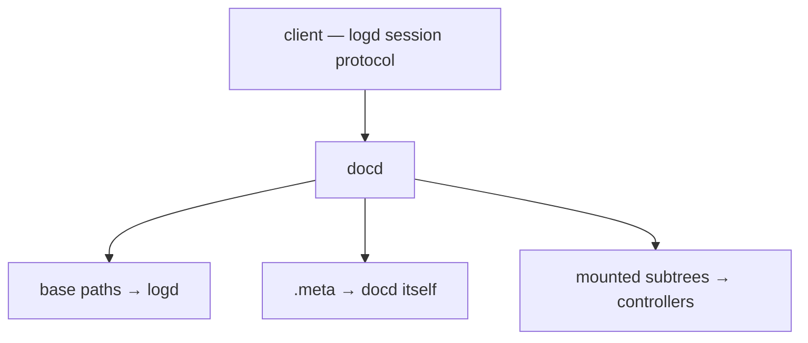

# docd

**docd** is a document daemon that fronts a logd store and lets external
*controllers* own subtrees of the document. Clients speak the logd session protocol
verbatim — they cannot tell whether they are talking to docd or to logd directly —
while parts of the document tree can be delegated to separate processes.

docd is a thin, fail-fast proxy that *routes* and *composes* operations across a base
store (logd) and mounted controllers, without caching document state.

## Two faces

docd speaks two protocols on two listeners:

- **Client-facing** — the logd session protocol: `Hello`, `Match` (read), `Patch`
  (write), `Watch`/`Unwatch`, `NewTx`, `DeleteScope`, `Schema`. This is exactly what
  logd exposes, so any logd client works against docd unchanged.
- **Mount-facing** — the MOUNT protocol. A controller dials in, handshakes, and
  registers a subtree (a *mount path* plus a schema). Reads, writes, and watches on
  that subtree are then served by the controller instead of logd.

## The mount model

- A path **outside every mount** is *base* — served by docd's own logd link.
- A path **at or under a mount** is served by that mount's **controller**.
- The reserved **`.meta`** namespace is served by **docd itself** (the mount list and
  the composed schema).

Routing is single-owner: one path has exactly one owner. Where an operation's path is
an *ancestor* of one or more mounts, docd **composes** the result across the owners
beneath it rather than picking one.

## Topic pages

### [Mounts & routing](./mounts.md)

The MOUNT protocol, the mount registry, single-owner routing, **tombstones**
(controller-down fails fast rather than falling through to logd), and the `.meta`
namespace.

### [Composition: reads & watches](./composition.md)

How an ancestor read or watch is **composed** across the base and the mounts beneath
it, the delta-rooting contract, mount/watch **coordination**, and the
**event-preservation / reconnect** contract — a logd guarantee that docd makes
best-effort across mount boundaries.

### [Multi-mount transactions](./transactions.md)

How a single client patch that spans several mounts is **decomposed** into one
multi-participant transaction, the transaction-id pool, and copy-on-write **scopes**.

## Key concepts

- **Mount** — a subtree delegated to a controller process. Single-owner: one path, one
  owner.
- **Base** — everything not under a mount; served directly from logd.
- **Tombstone** — a dead mount kept as a marker so its subtree fails loudly instead of
  silently reverting to logd.
- **Composition** — fanning an ancestor read/watch across base + mounts and merging
  the subtrees into one document.
- **Fail-fast proxy** — docd forwards and composes; it never caches document state, so
  there is no cache to invalidate and no stale view to serve.
