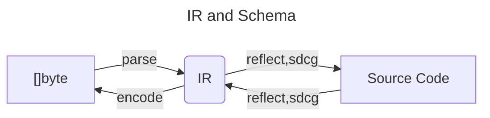
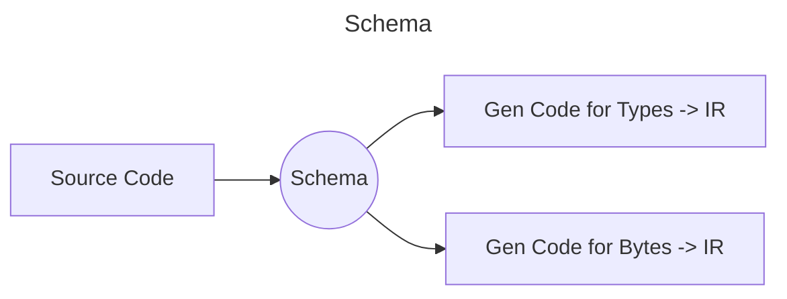

# Tony GoMappings

GoMap provides several mappings to and from Tony, and it's easy to switch
between them, from ad-hoc and easy to full fledged, schema driven type safe
codegen.  But perhaps most importantly, GoMap bridges the divide between
code-driven modeling and schema driven modeling.  One can mix and match and the
tools interoperate.
  
## Overview

There are Tony [schema](/docs/schema.md) and [IR](/docs/ir.md) coordinating
things.

### IR

The IR is a pivot point between reflection based adhoc `gomap.{To,From}Tony`
and schema-driven code generation (SDCG):



### Schema

Schema Provide a pivot point between code-driven modeling and schema-driven
modeling:



## Calling `gomap.{To,From}Tony`


```go
package main

import (
    "github.com/signadot/tony-format/go-tony/gomap"
)

type Person struct {
    Name  string
    Age   int
    Email *string  // Optional field (pointer)
}

func main() {
    // No schema tags needed!
    person := Person{Name: "Alice", Age: 30}
    
    data, err := gomap.ToTony(person)
    
    var p2 Person
    err = gomap.FromTony(data, &p2)
}
```

## `tony-codegen`

`tony-codegen` is a unified code generation tool that:

1. **Generates `.tony` schema files** from structs with `schemagen=` tags
2. **Generates Go code** (`ToTony()`/`FromTony()` methods) for structs from schema.

In this way, it interfaces with both schema-driven modeling and code driven modeling
interchangeably.

### Comment and struct tag Based Directives

```go
package models

// Person represents a person in the system.
// Use comment directives - cleaner and works with any type!
//tony:schemagen=person
type Person struct {
    // Name is the person's full name
    Name string `tony:"field=name"`
    
    // Age in years
    Age int `tony:"field=age"`
}

// Alternative: struct tag approach (requires dummy field)
type Employee struct {
    _ struct{} `tony:"schemagen=employee"`
    Name string
    Salary int
}
```

**After running `tony-codegen`, use generated methods:**

```go
func main() {
    person := Person{Name: "Alice", Age: 30}
    
    // Primary API: bytes-based methods
    data, err := person.ToTony()      // Serialize to bytes
    
    var p2 Person
    err = p2.FromTony(data)           // Deserialize from bytes
    
    // Advanced: IR-based methods (for IR manipulation)
    node, err := person.ToTonyIR()    // Get IR node
    err = p2.FromTonyIR(node)         // Load from IR node
}
```

**Mixed Reflection/Codegen Pattern**:

For structs that mix generated and non-generated fields, use an embedded struct:

```go
// Generated part - has schema
//tony:schemagen=person-core
type PersonCore struct {
    Name string
    Age  int
}

// Full struct - combines generated + reflection
type Person struct {
    PersonCore        // Generated methods available
    RuntimeData any   // Handled by reflection
}

func main() {
    p := Person{
        PersonCore: PersonCore{Name: "Alice", Age: 30},
        RuntimeData: map[string]interface{}{"key": "value"},
    }
    
    // Use generated method for core data
    coreNode, _ := p.PersonCore.ToTonyIR()
    
    // Use reflection for runtime data
    runtimeNode, _ := gomap.ToTonyIR(p.RuntimeData)
    
    // Combine as needed
}
```
### Generating Code

```bash
# Generate schemas and code
tony-codegen

# Or use go generate
go generate ./...
```

This generates:
- `schema_gen.tony` - Schema file (contains all schemas in the package)
- `models_gen.go` - Go code with `ToTony()`, `FromTony()`, `ToTonyIR()`, and `FromTonyIR()` methods

### Using Generated Methods

```go
// Serialize to Tony bytes (primary API)
person := &Person{Name: "Alice", Age: 30}
data, err := person.ToTony()

// Deserialize from Tony bytes
var p Person
err = p.FromTony(data)

// Advanced: Work with IR nodes directly
node, err := person.ToTonyIR()
err = p.FromTonyIR(node)
```

## Defining Schemas

There are two ways to define schemas for your structs: using **Doc Comment Directives** and **Struct Tags**.

### Doc Comment Directives

Use `//tony:` directives in doc comments. This is the cleanest approach and works for all types.  But
you'll need struct tags for custom field naming and options.

#### `//tony:schemagen=<name>`

Define a new schema and generate the `.tony` schema file.

```go
// Person represents a person in the system.
//tony:schemagen=person
type Person struct {
    Name string `tony:"field=name"`
    Age  int    `tony:"field=age"`
}
```

#### `//tony:schema=<name>`

Use an existing schema from the filesystem.

```go
//tony:schema=person
type Employee struct {
    Name   string
    Salary int
}
```

**Benefits of Directives:**
- Cleaner code (no dummy fields needed)
- Works on type aliases and interfaces
- Keeps metadata separate from struct definition

### Struct Tags (Alternative)

Alternatively, you can use a dummy field with a struct tag. This is useful if you prefer to keep all metadata within the struct definition.

#### `schemagen=<name>`

```go
type Person struct {
    _ struct{} `tony:"schemagen=person"`
    Name string
}
```

#### `schema=<name>`

```go
type Employee struct {
    _ struct{} `tony:"schema=person"`
    Name   string
    Salary int
}
```

#### Advanced Directives

Multiple directives can be combined. For example, to capture schema comments:

```go
//tony:schemagen=user
//tony:comment=UserComments
type User struct {
    ID   string
    Name string
    UserComments []string // Populated with schema comments during unmarshaling
}
```

Supported directives:
- `//tony:schemagen=<name>` - Define a new schema
- `//tony:schema=<name>` - Use an existing schema
- `//tony:comment=<field>` - Populate field with ir comments

**Note**: If both a struct tag and doc comment directive are present, the struct tag takes precedence.

> [!WARNING]
> **Compatibility Note**: Doc comment directives (`//tony:`) are only supported by the `tony-codegen` tool. They are **NOT** visible to the runtime reflection-based `gomap.ToIR()` and `gomap.FromIR()` functions, because Go reflection cannot access comments at runtime. If you use doc comment directives, you **MUST** use code generation (`ToTony`/`FromTony` methods). For reflection-based usage, you must use struct tags.

### Field Tags

#### `field=<name>`

Override the schema field name.

```go
type Person struct {
    FirstName string `tony:"field=first_name"`
}
```

The schema will use `first_name` as the field name instead of `FirstName`.

#### `omit`

Exclude a field from schema and serialization.

```go
type Person struct {
    Password string `tony:"omit"`  // Never serialized
}
```

#### `required`

Mark a field as required. Deserialization fails if the field is missing.

```go
type Person struct {
    ID string `tony:"required"`
}
```

#### `optional`

Mark a field as optional. Zero values are omitted during serialization.

```go
type Person struct {
    Email string `tony:"optional"`
}
```

## Type Mapping

### Basic Types

Go basic types map to Tony IR types:

```go
type Example struct {
    Text   string   // .[string]
    Count  int      // .[int]
    Score  float64  // .[float]
    Active bool     // .[bool]
}
```

### Pointers (Nullable Types)

Pointer types represent optional/nullable values:

```go
type Person struct {
    Email *string  // Optional field
}
```

Schema: `Email: .[nullable(string)]`

### Slices and Arrays

Slices map to Tony arrays:

```go
type Person struct {
    Tags []string
}
```

Schema: `Tags: .[array(string)]`

### Maps

Maps with string keys:

```go
type Config struct {
    Metadata map[string]string
}
```

Schema: `Metadata: .[object(string)]`

Maps with `uint32` keys (sparse arrays):

```go
type Sparse struct {
    Data map[uint32]string
}
```

Schema: `Data: .[sparsearray(string)]`

### Special Types

#### `*ir.Node`

The `*ir.Node` type represents any valid Tony value (similar to `interface{}` or `any` but typed for Tony IR). It maps to the `ir` schema defined in `tony-base`.

```go
type AnyData struct {
    Value *ir.Node
}
```

Schema: `Value: .[tony-base:ir]`

### Recursive Types

Self-referential types are supported via pointers:

```go
type Node struct {
    schemaTag `tony:"schemagen=node"`
    Value    int
    Parent   *Node   // Pointer to self
    Children []*Node // Slice of pointers to self
}
```

Schema:
```tony
define:
  Value: !irtype 1
  Parent: .[nullable(node)]
  Children: .[array(node)]
```

### Nested Structs

Structs with schemas become schema references:

```go
type Person struct {
    schemaTag `tony:"schemagen=person"`
    Name string
}

type Employee struct {
    schemaTag `tony:"schemagen=employee"`
    Person Person  // References person schema
    Salary int
}
```

Generated `employee.tony`:
```tony
define:
  Person: !person  # Schema reference
  Salary: !irtype 1
```

### Cross-Package Types

Types from other packages are automatically handled:

```go
import "github.com/example/format"

type Config struct {
    Format *format.Format  // Named type from another package
}
```

The type resolver:
- Detects cross-package types
- Resolves qualified names (e.g., `format.Format`)
- Adds necessary imports to generated code
- Handles both named types and pointer types

## Schema Generation

### Comment Preservation

Go comments are automatically included in generated schemas:

```go
// Person represents a user.
// Multi-line comments are supported.
type Person struct {
    schemaTag `tony:"schemagen=person"`
    
    // Name is the person's full name
    Name string
}
```

The generated schema includes these comments.

### Grouped Schema Files

When multiple structs in a package have `schemagen=` tags, they are all written to a single `schema_gen.tony` file, separated by `---` document separators:

```tony
# Code generated by tony-codegen. DO NOT EDIT.
context:
- tony-format/context
define:
  Street: !irtype ""
  City: !irtype ""
signature:
  name: address
---
context:
- tony-format/context
define:
  Name: !irtype ""
  Address: !address
signature:
  name: person
```

### Schema References

Structs can reference other schemas in the same package:

```go
type Address struct {
    schemaTag `tony:"schemagen=address"`
    Street string
    City   string
}

type Person struct {
    schemaTag `tony:"schemagen=person"`
    Name    string
    Address Address  // References address schema
}
```

Generated `schema_gen.tony`:
```tony
define:
  Name: .[string]
  Address: !address null # Schema reference
```


## Code Generation

### Generated Methods

For each struct with a schema tag, four methods are generated:

#### `ToTony(opts ...encode.EncodeOption) ([]byte, error)` - Primary API

Serializes the struct to Tony format bytes:

```go
func (s *Person) ToTony(opts ...encode.EncodeOption) ([]byte, error) {
    node, err := s.ToTonyIR(opts...)
    if err != nil {
        return nil, err
    }
    var buf bytes.Buffer
    if err := encode.Encode(node, &buf, opts...); err != nil {
        return nil, err
    }
    return buf.Bytes(), nil
}
```

#### `FromTony(data []byte, opts ...parse.ParseOption) error` - Primary API

Deserializes Tony format bytes into the struct:

```go
func (s *Person) FromTony(data []byte, opts ...parse.ParseOption) error {
    node, err := parse.Parse(data, opts...)
    if err != nil {
        return err
    }
    return s.FromTonyIR(node, opts...)
}
```

#### `ToTonyIR(opts ...encode.EncodeOption) (*ir.Node, error)` - Advanced

Serializes the struct to a Tony IR node (for advanced IR manipulation):

```go
func (s *Person) ToTonyIR(opts ...encode.EncodeOption) (*ir.Node, error) {
    irMap := make(map[string]*ir.Node)
    irMap["name"] = ir.FromString(s.Name)
    irMap["age"] = ir.FromInt(int64(s.Age))
    
    node := ir.FromMap(irMap)
    node.Tag = "!person"
    return node, nil
}
```

#### `FromTonyIR(node *ir.Node, opts ...parse.ParseOption) error` - Advanced

Deserializes a Tony IR node into the struct (for advanced IR manipulation):

```go
func (s *Person) FromTonyIR(node *ir.Node, opts ...parse.ParseOption) error {
    if node.Type != ir.ObjectType {
        return fmt.Errorf("expected object, got %v", node.Type)
    }
    
    if fieldNode := ir.Get(node, "name"); fieldNode != nil {
        if fieldNode.Type != ir.StringType {
            return fmt.Errorf("expected string, got %v", fieldNode.Type)
        }
        s.Name = fieldNode.String
    }
    
    // ... more fields
    return nil
}
```

### Optional Fields

Optional fields (pointers or tagged with `optional`) are handled specially:

```go
type Person struct {
    Email *string `tony:"field=email"`
}
```

Generated `ToTonyIR()`:
```go
// Only serialize if not nil
if s.Email != nil {
    irMap["email"] = ir.FromString(*s.Email)
}
```

Generated `FromTonyIR()`:
```go
// Populate pointer if field exists
if fieldNode := ir.Get(node, "email"); fieldNode != nil {
    val := new(string)
    *val = fieldNode.String
    s.Email = val
}
```

### Required Fields

Required fields are validated during deserialization:

```go
type Person struct {
    ID string `tony:"required"`
}
```

Generated `FromTonyIR()`:
```go
if fieldNode := ir.Get(node, "id"); fieldNode != nil {
    s.ID = fieldNode.String
} else {
    return fmt.Errorf("required field \"id\" is missing")
}
```

### Custom Marshaling

Override generated methods for custom behavior:

```go
// Custom implementation - code generation is skipped
func (p *Person) ToTonyIR() (*ir.Node, error) {
    // Custom serialization logic
    return customNode, nil
}
```

Note: Schema generation still occurs, but code generation is skipped when
methods already exist.

## The `tony-codegen` Tool

### Basic Usage

```bash
# Generate for current package
tony-codegen

# Generate for specific directory
tony-codegen -dir ./models

# Generate recursively
tony-codegen -recursive -dir ./...
```

### Command-Line Flags

- `-o <file>` - Output file for generated Go code (default: `<package>_gen.go`)
- `-dir <path>` - Directory to scan (default: current directory)
- `-recursive` - Scan subdirectories recursively
- `-schema-dir <dir>` - Output directory for schemas, preserves package structure
- `-schema-dir-flat <dir>` - Output directory for schemas, flat structure

### Schema Output Location

#### Default: Package Directory

By default, schemas are written to the same directory as source files:

```
models/
  ├── person.go
  ├── schema_gen.tony    (generated - contains all schemas)
  └── models_gen.go      (generated)
```

#### `-schema-dir` Flag

Preserve package structure in a separate directory:

```bash
tony-codegen -schema-dir ./schemas
```

Result:
```
schemas/
  └── models/
      └── schema_gen.tony
models/
  ├── person.go
  └── models_gen.go
```

#### `-schema-dir-flat` Flag

All schemas in one directory:

```bash
tony-codegen -schema-dir-flat ./schemas
```

Result:
```
schemas/
  └── schema_gen.tony
models/
  ├── person.go
  └── models_gen.go
```

### go generate Integration

```go
//go:generate tony-codegen
package models
```

Or with custom flags:

```go
//go:generate tony-codegen -schema-dir ./schemas
package models
```

## Processing Flow

The code generator follows this sequence:

1. **Discover packages** - Find Go packages to process
2. **Parse structs** - Extract struct definitions and tags
3. **Build dependency graph** - Determine struct dependencies
4. **Detect cycles** - Error if circular dependencies exist
5. **Topological sort** - Order structs by dependencies
6. **Generate schemas** - Create `.tony` files for `schemagen=` structs
7. **Load schemas** - Read schemas for `schema=` structs
8. **Generate code** - Create `ToTony()`, `FromTony()`, `ToTonyIR()`, and `FromTonyIR()` methods

This order ensures:
- Dependencies are processed before dependents
- Forward references work naturally
- Newly generated schemas are available for same-package references

## Error Handling

### Common Errors

#### Schema Not Found

```
Error: schema "person" not found
```

Solution: Ensure the schema file exists or run `tony-codegen` to generate it.

#### Type Mismatch

```
Error: field "age": expected number, got string
```

Solution: Ensure the Tony data matches the struct field types.

#### Required Field Missing

```
Error: required field "id" is missing
```

Solution: Provide all required fields in the Tony data.


## Examples

### Complete Example

```go
package models

import "time"

type schemaTag struct{}

// User represents a system user
type User struct {
    schemaTag `tony:"schemagen=user"`
    
    // Unique identifier
    ID string `tony:"field=id,required"`
    
    // User's email address
    Email string `tony:"field=email,required"`
    
    // Display name (optional)
    DisplayName *string `tony:"field=display_name"`
    
    // User roles
    Roles []string `tony:"field=roles"`
    
    // Account metadata
    Metadata map[string]string `tony:"field=metadata"`
    
    // Internal field (not serialized)
    password string `tony:"omit"`
}
```

Generated `user.tony`:
```tony
# Code generated by tony-codegen. DO NOT EDIT.
context: tony-format/context
define:
  ID: !irtype ""
  Email: !irtype ""
  DisplayName: .[nullable(string)]
  Roles: .[array(string)]
  Metadata: .[object(string)]
signature:
  name: user
```

### Usage Example

```go
// Serialize
user := &User{
    ID:    "123",
    Email: "alice@example.com",
    Roles: []string{"admin", "user"},
}
node, err := user.ToTonyIR()
if err != nil {
    log.Fatal(err)
}

// Write to file
file, _ := os.Create("user.tony")
encode.Encode(node, file)

// Read from file
file, _ = os.Open("user.tony")
node, _ = decode.Decode(file)

// Deserialize
var u User
if err := u.FromTonyIR(node); err != nil {
    log.Fatal(err)
}
```

## Conclusion

GoMap and `tony-codegen` provide a seamless bridge between Go and Tony format,
enabling type-safe serialization with automatic code generation and schema
validation. The tool handles complex scenarios including cross-package types,
forward references, and nested structures, while maintaining clean, idiomatic
Go code.
