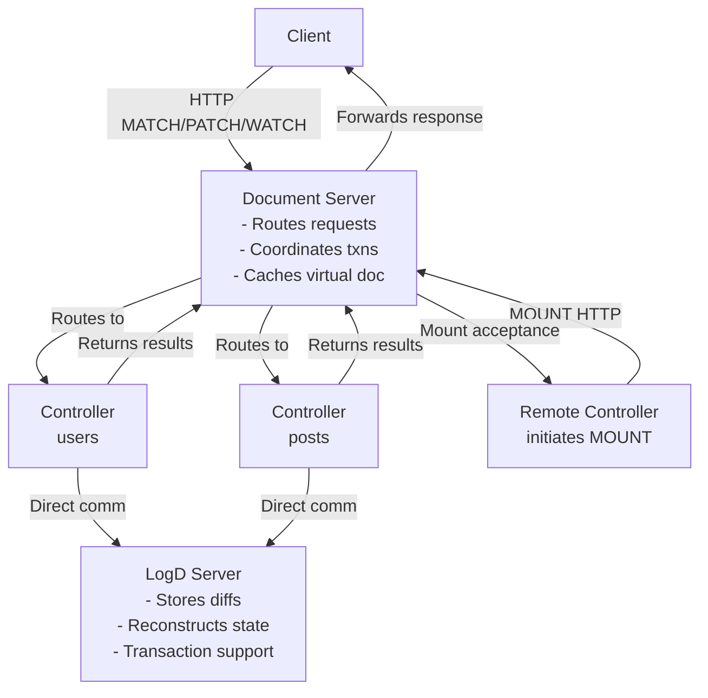

# TonyAPI Design

## Overview

TonyAPI presents access to "1 giant Tony document" as a computed view. The system consists of three main components working together to provide a unified API interface.

## Architecture: Three Components

The TonyAPI system consists of three main components:

### 1. Document Server

The **document server** is the entry point for client requests. It:

- Receives HTTP requests (MATCH, PATCH, WATCH, MOUNT)
- Routes operations to appropriate controllers based on mount points
- Coordinates transactions for multi-path operations
- Caches the virtual document view for performance
- Composes unified schema from controller contributions

**Key responsibilities:**

- Request routing and orchestration
- Transaction coordination
- Schema composition
- Virtual document caching

### 2. Controllers

**Controllers** are separate processes that handle operations for specific mount points in the virtual document. They:

- Communicate directly with the logd server (read state, write diffs)
- Handle MATCH operations (queries) for their mount point
- Handle PATCH operations (mutations) for their mount point
- Handle WATCH operations (subscriptions) for their mount point
- Validate operations and enforce business logic
- Contribute schema definitions during MOUNT registration

**Types of controllers:**

- **Local controllers**: Spawned by document server, communicate via stdin/stdout
- **Remote controllers**: Connect to document server, communicate via network

**Key responsibilities:**

- Operation validation
- State management for their mount point
- Direct communication with logd server
- Schema contribution

For detailed controller documentation, see [controllers.md](./controllers.md).

### 3. LogD Server

The **logd server** is the storage backend that:

- Stores diffs (changes) as the source of truth, not full state
- Reconstructs current state by applying all diffs in sequence
- Provides transaction support with participant counting
- Ensures atomicity for multi-path operations
- Maintains complete history/audit trail

**Key responsibilities:**
- Diff storage and retrieval
- State reconstruction
- Transaction coordination
- History and time-travel queries

For detailed logd server design, see [logd-server-design.md](./logd-server-design.md).

## Component Relationships



**Data Flow:**

### Client Request Flow (MATCH/PATCH/WATCH)

1. **Client → Document Server**: Client sends HTTP request (MATCH/PATCH/WATCH) with operation document
2. **Document Server → Controller**: Routes operation to appropriate controller(s) based on mount points
3. **Controller → LogD Server**: Controller reads state or writes diffs directly to logd server
4. **Controller → Document Server**: Controller returns results (query results, revision numbers, or errors)
5. **Document Server → Client**: Document server forwards response to client

### Controller Registration Flow (MOUNT)

1. **Controller → Document Server**: Remote controller initiates connection and sends `MOUNT` request with mount point path, configuration, and schema contribution
2. **Document Server**: Validates mount request and accepts registration
3. **Document Server**: Composes unified schema with controller's contribution
4. **Document Server → Controller**: Confirms mount acceptance; connection remains open for operation routing

**Key principles:**

- Controllers are the **only** components that communicate with the logd server. The document server orchestrates but doesn't store diffs or act as an intermediary for logd operations.
- **Controllers initiate MOUNT** - Remote controllers connect to the document server (not the other way around). Local controllers are spawned by the document server.

## Virtual Document Model

The API exposes **one giant Tony document** as a virtual/computed view. All operations (queries, mutations, subscriptions) operate on this document.

For a complete example of a virtual document structure, see [blog-api-example.md](./blog-api-example.md).

**Key concepts:**
- Mount points (like `/users`, `/posts`) are handled by controllers
- Controllers read from/write to the same logd server
- The document server presents a unified view

## HTTP Protocols

TonyAPI uses four HTTP methods for different operations:

### MATCH (Queries)

**Purpose**: Query/read data from the virtual document

**Flow**:
1. Client sends `MATCH` request with query document
2. Document server routes query to appropriate controller(s) based on `path:`
3. Controller reads current state from logd server
4. Controller filters state to match query criteria
5. Controller returns result document to document server
6. Document server forwards result to client

**Characteristics:**

- Query document has `path:` and `match:` but **no `patch:`**
- Supports field selection, filtering, nested queries, and joins
- Returns result documents matching the query structure

For detailed query format specifications and examples, see [queries.md](./queries.md).

### PATCH (Mutations)

**Purpose**: Modify data in the virtual document

**Flow**:
1. Client sends `PATCH` request with mutation document
2. Document server determines affected mount points
3. **Single-path mutation**:
   - Document server routes diff to appropriate controller
   - Controller validates and applies diff to logd server
   - Controller returns revision number
4. **Multi-path mutation** (transaction):
   - Document server requests transaction ID from logd server
   - Document server routes diffs to all relevant controllers with transaction ID
   - Controllers validate and apply diffs to logd server with transaction ID
   - LogD server commits atomically when all participants complete
   - Controllers return revision numbers
5. Document server responds to client with success or error

**Characteristics:**

- Mutation document has `path:`, `match:`, and **`patch:`**
- Uses Tony diff operations (`!replace`, `!insert`, `!delete`, etc.)
- Returns revision numbers (not diffs) for successful mutations
- Guaranteed atomicity for multi-path operations

For detailed mutation format specifications, see [mutations.md](./mutations.md).

### WATCH (Subscriptions)

**Purpose**: Subscribe to changes in the virtual document

**Flow**:
1. Client sends `WATCH` request with query document
2. Document server registers watch and routes query to controller(s)
3. Controller watches logd server for changes affecting the query
4. When changes occur, controller computes diffs and sends to document server
5. Document server streams diffs to client (server-side push)
6. Connection remains open until client closes or timeout

**Characteristics:**

- Uses same query document format as MATCH (no `patch:`)
- Server maintains query result state
- Server pushes diffs as changes occur
- Client reconstructs current state by applying diffs

For detailed WATCH format specifications, see [subscriptions.md](./subscriptions.md).

### MOUNT (Controller Registration)

**Purpose**: Register remote controllers with the document server

**Flow**:
1. Remote controller initiates connection to document server
2. Controller sends `MOUNT` request with mount point path, configuration, and schema contribution
3. Document server validates and accepts mount
4. Document server composes unified schema with controller's contribution
5. Document server routes operations to controller for that mount point

**Characteristics**:
- Controllers initiate connection (not document server)
- Controllers provide schema definitions during mount
- Unified schema accessible at `/.meta/schema`

## Example: Blog API

Throughout this document, we use a blog API example to illustrate concepts. For the complete virtual document structure, schema definition, and design decisions, see [blog-api-example.md](./blog-api-example.md).

## Detailed Format Specifications

This section provides links to detailed format specifications. All formats use Tony documents with `!apiop` tags.

- **[Mutation Formats](./mutations.md)**: Detailed mutation format specifications with examples
- **[Subscription Formats (WATCH)](./subscriptions.md)**: Detailed WATCH/subscription format specifications
- **[HTTP Protocols](./http-protocols.md)**: HTTP request/response formats for all operations (MATCH, PATCH, WATCH, MOUNT)
- **[Query Formats](./queries.md)**: Detailed query format specifications and examples
- **[Schema Formats](./schema.md)**: Schema format specifications and composition

## Comparison with GraphQL

For a detailed comparison between TonyAPI and GraphQL, including similarities, differences, advantages, trade-offs, and use cases, see [graphql-comparison.md](./graphql-comparison.md).

**Key highlights:**
- **Transaction support**: TonyAPI has built-in protocol-level transactions, while GraphQL has no transaction support in its specification
- **Mental model**: GraphQL presents a graph of types; TonyAPI presents one unified document (filesystem-like)
- **Relations**: GraphQL defines relations in schema; TonyAPI has relations as concrete structures in the document
- **Format**: GraphQL uses custom query language; TonyAPI uses Tony format (YAML-like) for all operations

## Design Philosophy: Plan 9 / procfs Analogy

If we consider the virtual document as similar to a filesystem, we can draw inspiration from Plan 9's "everything is a file" philosophy and **9p** protocol. Linux's `/proc` (procfs) was inspired by Plan 9's model:

### Plan 9 Philosophy

**Plan 9** had a philosophy where "everything is a file" - processes, network connections, system state, etc. were all accessible as files. **Linux's `/proc` (procfs)** was inspired by this and exposes process information as files - `/proc/123/status`, `/proc/self/mem`, etc.

**TonyAPI equivalent**: Different parts of the virtual document can be "mounted" from different sources, similar to how Plan 9 allowed mounting various system resources:

```tony
# The virtual document with "mount points"
users:          # Mounted from database
- id: "123"
  name: "Alice"

posts:          # Mounted from database
- id: "post1"
  title: "First Post"

config:         # Mounted from file system
  appName: "MyApp"
  version: "1.0"

metrics:        # Mounted from Plan 9-like source (real-time system data)
  cpu: 45.2
  memory: 1024

remote:         # Mounted via 9p-like protocol
  data: ...
```

### 9p Analogy

**9p** is a simple protocol for file operations (read, write, stat, open, etc.) that works over networks. TonyAPI uses HTTP methods inspired by 9p's simplicity:

- **MATCH**: Query a path using `!apiop` document (no `patch:`)
- **PATCH**: Mutate a path using `!apiop` document with `patch:`
- **MATCH** (metadata): Access metadata via explicit paths (e.g., `/.meta/users/123`)
- **WATCH**: Monitor changes using `!apiop` document (no `patch:`)
- **MOUNT**: Register a remote controller process for a mount point

For detailed HTTP protocol formats and examples, see [http-protocols.md](./http-protocols.md).

### Benefits of Filesystem Model

1. **Uniform Interface**: Everything is just paths in a document tree
2. **Composability**: Mount different sources at different paths
3. **Simple Operations**: Just read/write/watch paths
4. **Remote Access**: 9p-like protocol works over network naturally
5. **Caching**: Filesystem-like caching strategies apply
6. **Permissions**: Filesystem-like permissions per path

## Additional Resources

- **[Controllers](./controllers.md)**: Comprehensive controller documentation including lifecycle, communication, and transaction coordination
- **[Query Operations](./queries.md)**: Detailed query format specifications and examples
- **[Mutation Formats](./mutations.md)**: Detailed mutation format specifications with examples
- **[Subscription Formats](./subscriptions.md)**: Detailed WATCH/subscription format specifications
- **[HTTP Protocols](./http-protocols.md)**: HTTP request/response formats for all operations
- **[Schema Formats](./schema.md)**: Schema format specifications and composition
- **[GraphQL Comparison](./graphql-comparison.md)**: Comprehensive comparison with GraphQL
- **[LogD Server Design](./logd-server-design.md)**: Backend storage architecture and transaction implementation
- **[Blog API Example](./blog-api-example.md)**: Complete example API used throughout documentation
- **[Process Controller Example](./process-controller-example.md)**: Example systems-level controller implementation


### Questions for Design

1. **Query format**: Using `{ field: null }` to express field selection in queries (null means "match anything, include this field").
2. **Error format**: How to represent errors in diff format?
3. **Controller discovery**: 
   - **Core controllers**: Document server configuration defines kernel-level/core controllers (e.g., filesystem, database mounts)
   - **Remote controllers**: Controllers initiate connection to document server and request MOUNT (see below)
4. **Multiple instances**: Can multiple controllers handle same mount level?
5. **Buffering**: How to handle buffering of stdin/stdout?
6. **State synchronization**: How to handle controllers that disconnect and reconnect?

